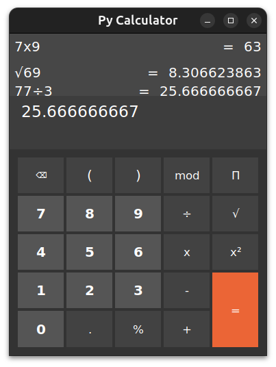

# pycalculator
PyCalculator is my attempt to create a ubuntu calculator with python tkinter

## Step for running
1. Checkout the repo in local
2. Open terminal for the repo
3. Run ```~$ python main.py```

## Calculator Screenshot

